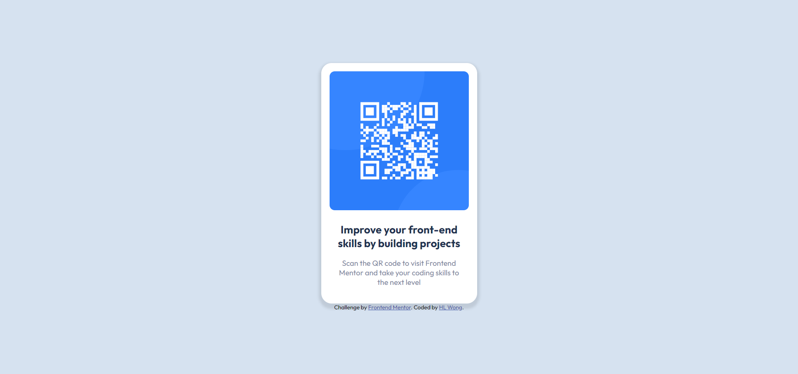
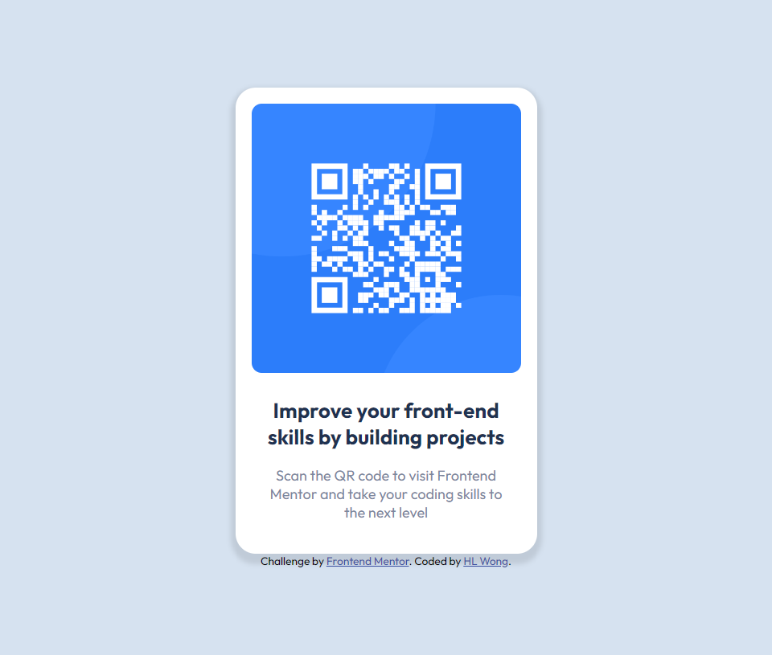
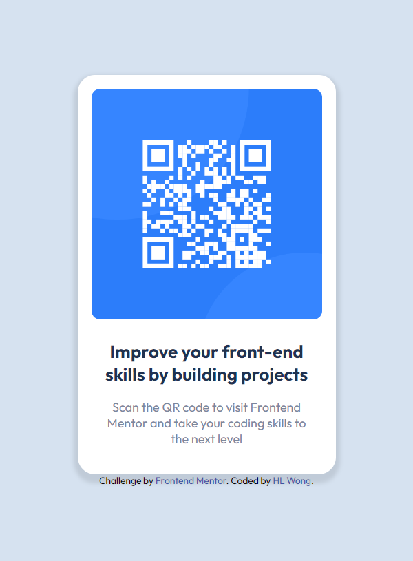

# Frontend Mentor - QR code component solution

This is a solution to the [QR code component challenge on Frontend Mentor](https://www.frontendmentor.io/challenges/qr-code-component-iux_sIO_H). Frontend Mentor challenges help you improve your coding skills by building realistic projects. 

## Table of contents

- [Overview](#overview)
  - [Screenshot](#screenshot)
  - [Links](#links)
- [My process](#my-process)
  - [Built with](#built-with)
  - [What I learned](#what-i-learned)
  - [Continued development](#continued-development)
- [Author](#author)

## Overview

### Screenshot

**Desktop** 

**Tablet** 

**Mobile** 

### Links

- Solution URL: [Solution](https://www.frontendmentor.io/solutions/qr-code-component-uLqBgHtaet)
- Live Site URL: [Live Site](https://dwz-wong.github.io/qr-code-component/)

## My process

### Built with

- Semantic HTML5 markup
- CSS custom properties
- Flexbox

### What I learned

I have practiced HTML and CSS on this project to improve my front-end development skills.

### Continued development

I aim to improve my front-end development skills whenever I have a project challenge.

## Author

- DEV - [@dwz_wong](https://dev.to/dwz_wong)
- Frontend Mentor - [@dwz-wong](https://www.frontendmentor.io/profile/dwz-wong)
- Twitter - [@dwz_wong](https://twitter.com/dwz_wong)

